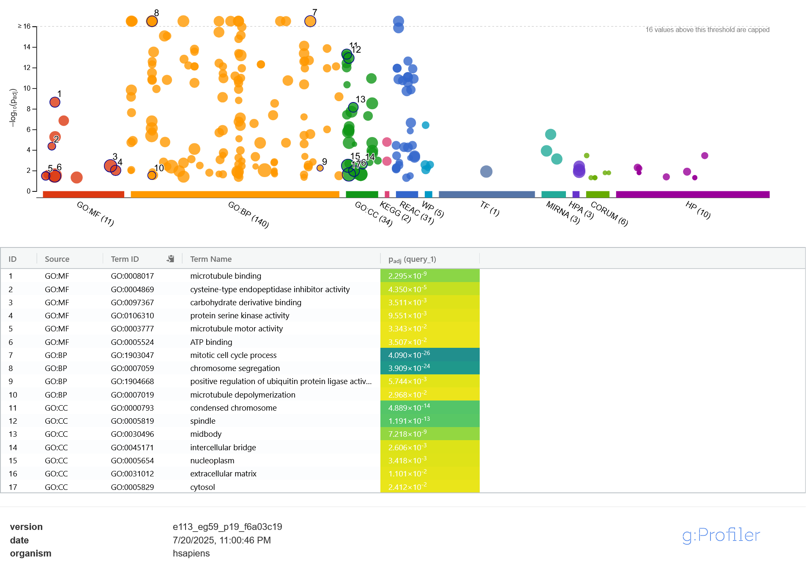
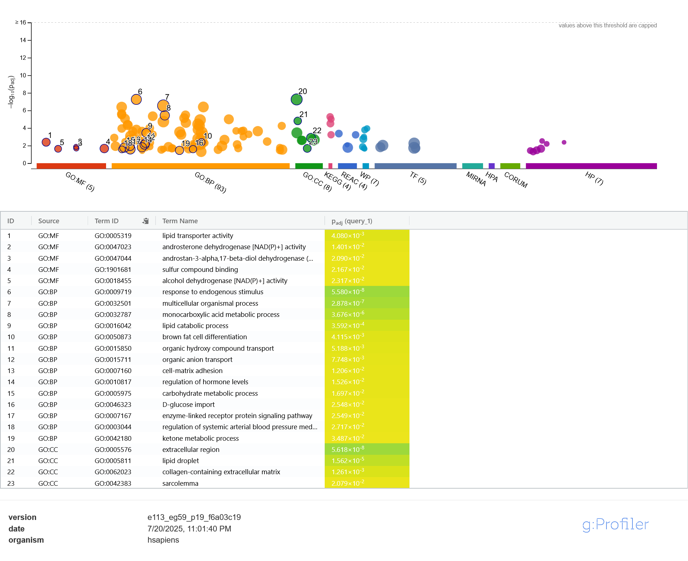

# 🩺 Breast Cancer Gene Expression Subtype Analysis

This project analyzes RNA-seq gene expression data from breast cancer patients to identify subtype-specific expression patterns and dysregulated biological processes.

---

### 🔬 Goals
- Visualize global gene expression variation using PCA
- Identify differentially expressed genes (DEGs) between breast cancer subtypes
- Explore enriched GO/KEGG pathways among upregulated and downregulated genes

---

### 📁 Files
- `Breast_Cancer_Gene_Expression.ipynb`: Main notebook with all analysis
- `phenotype.tsv`: Clinical metadata with sample subtype info
- `upregulatedgenes.png`: Enriched GO/KEGG terms for upregulated genes
- `downregulatedgenes.png`: Enriched GO/KEGG terms for downregulated genes

---

### 📈 Enrichment Results

#### 🔺 Upregulated in Subtype A

Key enriched terms:
- **microtubule binding**
- **ATP binding**
- **mitotic cell cycle**
- **chromosome segregation**

---

#### 🔻 Downregulated in Subtype A

Key enriched terms:
- **lipid transporter activity**
- **alcohol dehydrogenase activity**
- **cell-matrix adhesion**
- **collagen-containing extracellular matrix**

---

### 🧪 Methods
- Welch's t-test for differential expression
- Benjamini-Hochberg FDR correction
- Enrichment analysis using [g:Profiler](https://biit.cs.ut.ee/gprofiler)

---

### 🚀 Coming Soon
- GO term network visualizations
- Subtype clustering refinement
